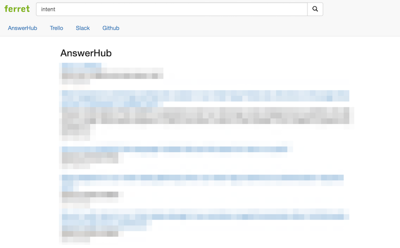

## Ferret

[![Release][release-image]][release-url] [![GoDoc][godoc-image]][godoc-url] [![Build Status][travis-image]][travis-url]

Ferret is a search engine that unifies search results from different resources
such as Github, Slack, Trello, AnswerHub and more. It can be used via
[CLI](#cli), [UI](#ui) or [REST API](#rest-api)

Distributed knowledge and avoiding context switching are very important for
efficiency. Ferret provides a unified search interface for retrieving and
accessing to information with minimal effort.


### Installation

| Mac | Linux | Win |
|:---:|:---:|:---:|
| [64bit][download-darwin-amd64-url] | [64bit][download-linux-amd64-url] | [64bit][download-windows-amd64-url] |

[See](#build) for building from source.


### Usage

Make sure Ferret is [configured](#configuration) properly before use it.

#### Help

```bash
ferret -h
```

#### CLI

```bash
# Search Github
# For more Github search syntax see https://developer.github.com/v3/search/
ferret search github intent
ferret search github intent+extension:md

# Search Slack
ferret search slack "meeting minutes"

# Search Trello
ferret search trello milestone

# Search AnswerHub
ferret search answerhub vpn

# Search Consul
ferret search consul influxdb

# Pagination
# Number of search result for per page is 10
ferret search trello milestone --page 2

# Timeout
ferret search trello milestone --timeout 5000ms

# Limit
ferret search trello epics --limit 100

# Opening search results
# Search for 'milestone' keyword on Trello and go to the second search result
ferret search trello milestone
ferret search trello milestone --goto 2
```

#### UI

```bash
ferret listen

# open http://localhost:3030/
```



#### REST API

```bash
# Listen for HTTP requests
ferret listen

# Search by REST API
curl 'http://localhost:3030/search?provider=answerhub&keyword=intent&page=1&timeout=5000ms'
```


### Configuration

#### Credentials;

- [Github token](https://help.github.com/articles/creating-an-access-token-for-command-line-use/)
- [Slack token](https://api.slack.com/docs/oauth-test-tokens)
- [Trello key](https://trello.com/app-key)
  - For Trello token visit https://trello.com/1/authorize?key=REPLACEWITHYOURKEY&expiration=never&name=SinglePurposeToken&response_type=token&scope=read
- [AnswerHub](http://docs.answerhub.com/articles/1444/how-to-enable-and-grant-use-of-the-rest-api.html)
  - For username and password visit 'My Preferences->Authentication Modes' in your AnswerHub site

#### ferret.yml

Set `FERRET_CONFIG` environment variable;

```bash
# macOS, linux
export FERRET_CONFIG=~/ferret.yml

# win
set FERRET_CONFIG=%HOMEDRIVE%%HOMEPATH%/ferret.yml
```

Save the following configuration into `ferret.yml` file in your home folder.

```yaml
search:
  timeout: 5000ms # timeout for search command. Default is `5000ms`
  gotoCmd: open   # used by `--goto` argument for opening links. Default is `open`
listen:
  address: :3030  # HTTP address for the UI and the REST API. Default is :3030
  pathPrefix:     # a URL path prefix for the UI (i.e. /ferret/)
  providers:      # a comma separated list of providers. Default is base on config.yml
providers:
  - provider: answerhub
    url:      {{env "FERRET_ANSWERHUB_URL"}}
    username: {{env "FERRET_ANSWERHUB_USERNAME"}}
    password: {{env "FERRET_ANSWERHUB_PASSWORD"}}
  - provider: consul
    url: {{env "FERRET_CONSUL_URL"}}
  - provider: github
    url:      {{env "FERRET_GITHUB_URL"}}
    username: {{env "FERRET_GITHUB_SEARCH_USER"}}
    token:    {{env "FERRET_GITHUB_TOKEN"}}
  - provider: slack
    token: {{env "FERRET_SLACK_TOKEN"}}
  - provider: trello
    token: {{env "FERRET_TRELLO_TOKEN"}}
    key:   {{env "FERRET_TRELLO_KEY"}}
```

Set the environment variables base on `ferret.yml` and credentials. 

_Note: Environment directives (`{{env ...}}`) can be replaced with credentials.
But it's not recommended for production usage._


### Build

```bash
go get -u -v github.com/yieldbot/ferret
cd $GOPATH/src/github.com/yieldbot/ferret
go generate ./assets
go build
```


### Test

```bash
./test.sh
```


### Release

Releases are handled by [Travis CI](https://travis-ci.org/yieldbot/ferret)

```bash
# Update CHANGELOG.md and README.md
git add CHANGELOG.md README.md

git commit -m "v1.0.0"         # replace v1.0.0 with new version
git tag -a v1.0.0 -m "v1.0.0"  # replace v1.0.0 with new version
git push --follow-tags         # or git push && git push --tags
```


### Contributing

All contributions are welcome. However there are rules and guidelines;

- Code contributions must be through pull requests
- Run tests, linting and formatting before a pull request (`test.sh`)
- Pull requests can not be merged without being reviewed
- Use "Issues" for bug reports, feature requests and discussions
- Do not refactor existing code without a discussion
- Do not add a new third party dependency without a discussion
- Use semantic versioning and git tags for versioning


### License

Licensed under The MIT License (MIT)  
For the full copyright and license information, please view the LICENSE.txt file.


[travis-url]: https://travis-ci.org/yieldbot/ferret
[travis-image]: https://travis-ci.org/yieldbot/ferret.svg?branch=master

[godoc-url]: https://godoc.org/github.com/yieldbot/ferret
[godoc-image]: https://godoc.org/github.com/yieldbot/ferret?status.svg

[release-url]: https://github.com/yieldbot/ferret/releases/latest
[release-image]: https://img.shields.io/badge/release-v3.1.1-blue.svg

[download-darwin-amd64-url]: https://github.com/yieldbot/ferret/releases/download/v3.1.1/ferret-darwin-amd64.zip
[download-linux-amd64-url]: https://github.com/yieldbot/ferret/releases/download/v3.1.1/ferret-linux-amd64.zip
[download-windows-amd64-url]: https://github.com/yieldbot/ferret/releases/download/v3.1.1/ferret-windows-amd64.zip
